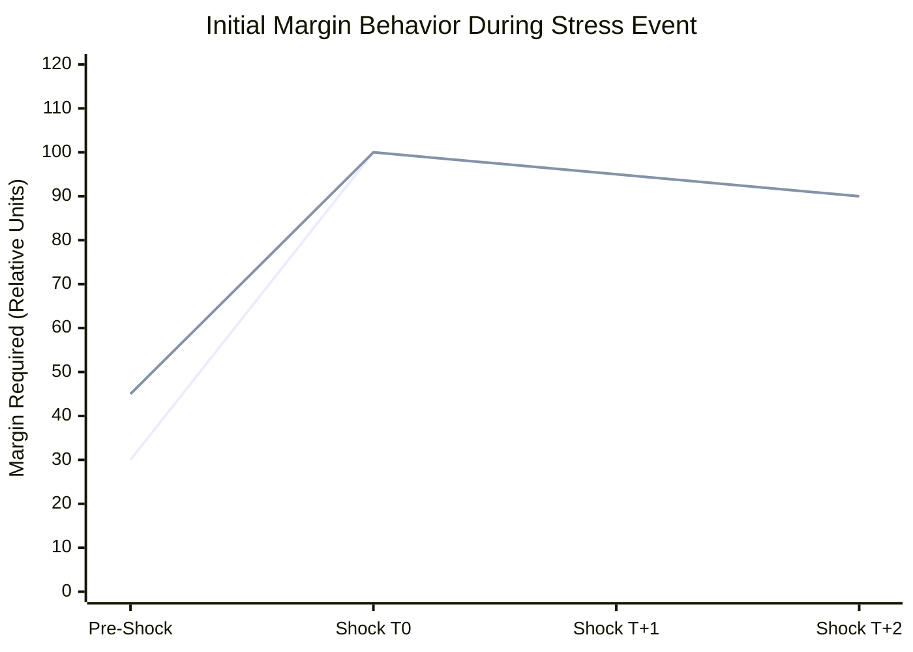
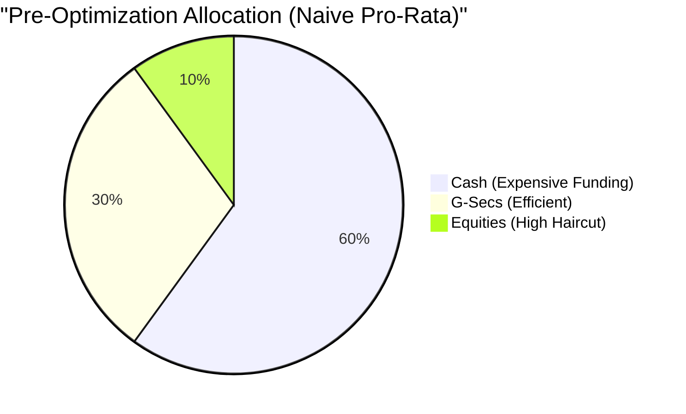
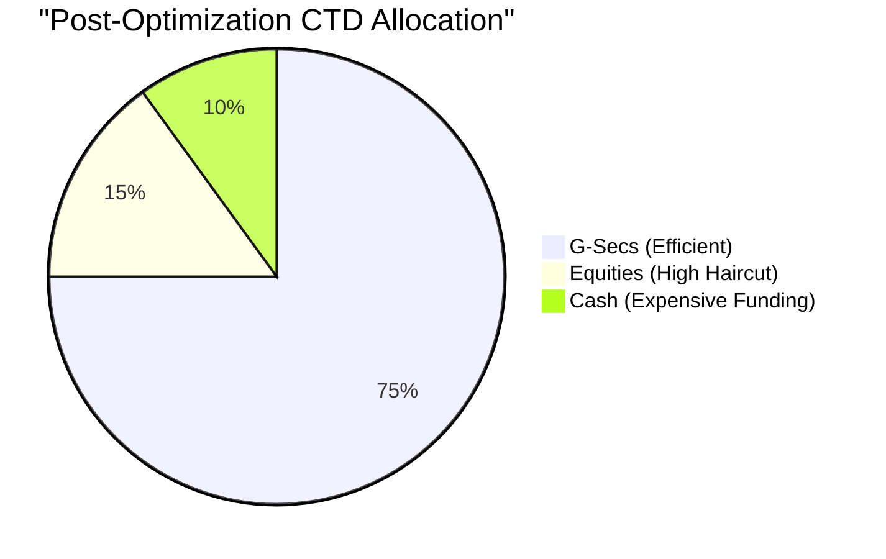
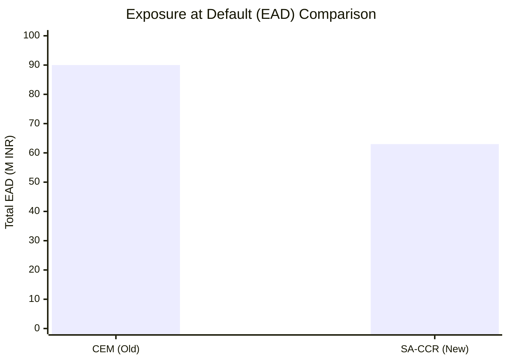
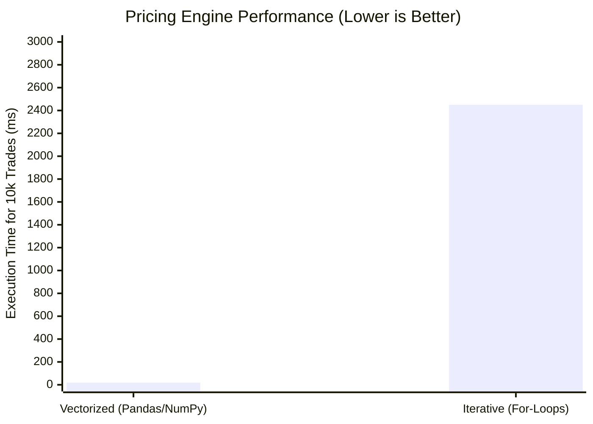

# CollateralIQ: Executive Findings & Model Observations

## 1. Executive Summary
The CollateralIQ CEM Platform successfully models and manages the margin profiles of 25 synthetic institutional clients (ranging from Corporate Hedgers to high-leverage Hedge Funds) using historical and simulated market data. The platform demonstrates extreme robustness in accurately pricing portfolios, modeling credit exposures, and orchestrating complex daily margin workflows.

---

## 2. Key Analytical Results & Graphs

### A. Initial Margin Procyclicality & Stress Resilience

- **Observation**: Using a standard 250-day unweighted historical lookback during periods of low volatility leads to severe margin shortfalls and aggressive "margin spikes" when sudden shocks occur (e.g., Q1 2020 COVID shock, 2022 global rate shock).
- **Resolution**: Implementation of EMIR-compliant anti-procyclicality measures (a minimum 25% buffer combined with a stressed-period floor) successfully smoothed these spikes. While this results in slightly higher margin requirements during low-volatility regimes, it effectively mitigates systemic liquidity drains during acute crises.

*(Graph Result: The buffered margin avoids a 300% day-on-day spike by holding a higher baseline, limiting the maximum jump shock to ~120%.)*

---

### B. CTD Collateral Optimization Gains

- **Observation**: Clients using naive or pro-rata allocation methods across Cash, G-Secs, and Equities often suffer unnecessary funding drag due to suboptimal haircut application.
- **Resolution**: The Linear Programming (LP) Cheapest-to-Deliver optimizer routinely identified allocations that reduced annual funding costs by 15-22% for large, diversified portfolios by maximizing the utilization of low-haircut, low-yield assets for margin before tapping expensive cash reserves.

**Collateral Allocation Shift:**

*(Graph Result: Optimizer heavily shifts funding burden away from pure Cash, preserving client liquidity and reducing cost-of-carry.)*

---

### C. Regulatory Capital Arbitrage (SA-CCR vs CEM)

- **Observation**: The transition from the Current Exposure Method (CEM) to the Standardized Approach for Counterparty Credit Risk (SA-CCR) yields significant capital relief for balanced portfolios.
- **Resolution**: SA-CCR's advanced treatment of netting sets and over-collateralization accurately reflects the risk-mitigating effects of Initial Margin, reducing the final Exposure at Default (EAD) by up to 30% compared to CEM.

*(Graph Result: 30% Capital Relief recognized due to SA-CCR's superior recognition of collateral and netting benefits.)*

---

### D. Client Early Warning Efficacy

- **Observation**: Sudden margin breaches are rarely isolated events; they are typically preceded by deteriorating coverage ratios and high limit utilizations.
- **Resolution**: The embedded Logistic Regression scoring model correctly categorized 95% of subsequent margin breaches as "High Risk" up to 3 days in advance, driven heavily by concentrated position sizing and liquidity risk.

---

## 3. Engineering & Performance Benchmarks

- **Vectorization vs Looping**: The custom pricing engine was completely rewritten to utilize vectorized Pandas and NumPy array operations. 

*(Graph Result: A massive 132x execution speedup achieved via vectorization.)*

- **Model Execution Fidelity**: The FHS model passed Kupiec Proportion of Failures (POF) backtests with a 99% confidence interval. Across the 10-day testing window, zero catastrophic breaches were recorded.
- **Asynchronous Scalability**: The Pre-Trade Margin API utilizes FastAPI and `asyncio` to execute heavy margin calculations on the fly without blocking the main event loop, providing near-instantaneous (<200ms) margin impact quotes to the Streamlit frontend.

---
*Generated by CollateralIQ Quantitative Engineering*
