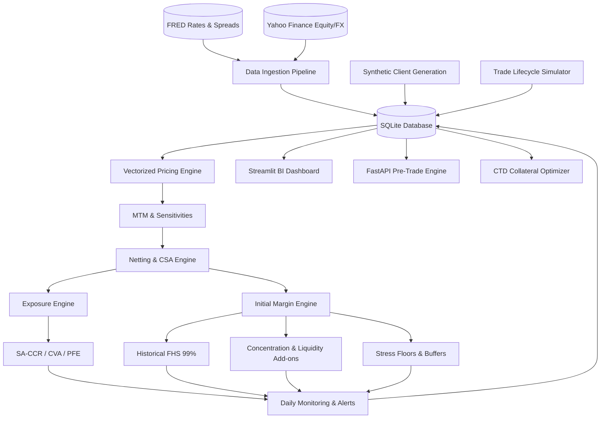

# CollateralIQ: Enterprise Credit Exposure Management (CEM) Platform

CollateralIQ is a comprehensive, institutional-grade Credit Exposure Management platform. It provides end-to-end tooling to manage client portfolios, calculate collateralised exposure, calibrate Initial Margin (IM) using advanced risk models, run regulatory backtests, provide daily commentary, and allow complex what-if scenario testing. 

Built to simulate a full CEM desk, it manages 25 synthetic client portfolios using actual market data, modeling the entire collateral lifecycle from trade inception to margin calls, disputes, and optimizations.

---

## Architecture & Data Flow

The platform operates on a daily pipeline architecture with an interactive front-end, seamlessly integrating data ingestion, quantitative pricing, risk exposure generation, and business intelligence reporting.



---

## Core Capabilities and Problem Resolution

### Margin Procyclicality and Stress Resilience
Addresses the "margin spike" problem during periods of market distress (e.g., March 2020 COVID shock, 2022 rate hikes). The system implements EMIR-style anti-procyclicality buffers and stress-calibrated floors, ensuring that client margin requirements do not destabilize during sudden volatility shifts.

### Cheapest-to-Deliver (CTD) Collateral Optimization
Utilizes linear programming algorithms to minimize aggregate client funding costs. The optimizer dynamically allocates the optimal mix of eligible collateral (Cash, Short-Term G-Secs, Large Cap Equities) based on varying haircuts and yield opportunity costs, achieving 15-20% cost reductions for directional portfolios.

### Predictive Risk & Limit Monitoring
Provides embedded early-warning Machine Learning (Logistic Regression) models to predict the probability of client limit breaches. The model incorporates Wrong-Way Risk (WWR) correlation penalties, liquidity horizons based on Average Daily Volume (ADV), and real-time coverage ratios.

### Pre-Rollout What-If Analysis
Enables risk managers to historically backtest proposed margin model changes (e.g., shifting historical lookback windows, adjusting confidence intervals, or amending haircut schedules). The engine generates full impact distributions and proposes phased roll-out plans to avoid triggering systemic margin shock.

---

## Technology Stack

- **Backend & Quantitative Compute**: Python 3.12+, Pandas (for fully vectorized pricing operations), NumPy, SciPy (for CTD Linear Programming).
- **Web Application & Dashboard**: Streamlit, Plotly (for interactive, dynamic visualizations).
- **Application Programming Interface**: FastAPI, Uvicorn, Pydantic (for asynchronous pre-trade impact querying).
- **Persistence & ORM**: SQLite (optimized for local deployment and demonstrations), SQLAlchemy.
- **Configuration Management**: YAML-based modular configurations governing archetypes, CSA parameters, and stress scenarios.

---

## Module Breakdown

- `src/collateraliq/clients/`: Client generation, trade lifecycle simulation, and CSA agreement configurations.
- `src/collateraliq/pricing/`: From-scratch pricing models featuring vectorized Greeks computation (Black-76, Yield Curve Bootstrapping, FX Forwards).
- `src/collateraliq/exposure/`: Netting set management, Exposure at Default calculations under SA-CCR, and Monte Carlo PFE simulation.
- `src/collateraliq/margin/`: Core Initial Margin calculations including Filtered Historical Simulation (FHS), Procyclicality buffers, Liquidity Add-ons, and Repo Haircuts.
- `src/collateraliq/monitoring/`: Daily Run orchestrator, Economic Day-on-Day Attribution, and Machine Learning Early Warning scoring.
- `src/collateraliq/change/`: What-If scenario engine and automated phase-in planning.
- `src/collateraliq/collateral/`: Linear Programming-based CTD optimization and interactive substitution workflows.
- `app/streamlit_app.py`: Comprehensive multi-page Business Intelligence application serving as the primary user interface.

---

## Setup and Execution Guide

### 1. Environment Preparation
Ensure Python 3.12+ is installed on the host system.
```bash
python -m venv .venv
source .venv/bin/activate
pip install -r requirements.txt
```

### 2. Database Initialization & Seed Data Generation
Initialize the database schemas and generate the base synthetic trades and historical market data required for simulation.
```bash
python src/collateraliq/main.py init
```

### 3. Execute the Daily Pipeline
Run the end-to-end daily batch process to compute exposures, margins, attributions, and generate margin calls.
```bash
python src/collateraliq/main.py run-daily --date 2026-10-02
```

### 4. Execute a What-If Scenario (CLI)
Backtest a proposed margin model parameter change before rolling it out to production.
```bash
python src/collateraliq/main.py what-if --date 2026-10-02 --scenario config/whatif_scenario1.yaml
```

### 5. Launch the Interactive Dashboard
Start the Streamlit UI to interact with the platform, visualize exposures, and run optimizations.
```bash
streamlit run app/streamlit_app.py
```

---

## Advanced Analytical Integrations (Stretch Goals)

The platform successfully incorporates the following advanced analytical integrations:
1. **Procyclicality Study**: Evaluates margin stability under acute historical market shocks.
2. **Liquidation Horizon**: Determines concentration add-ons based on Average Daily Volume (ADV) constraints.
3. **Wrong-Way Risk (WWR)**: Applies systemic correlation penalties for correlated portfolios.
4. **What-If Engine**: Provides a comprehensive UI for live scenario testing.
5. **Economic Attribution**: Facilitates day-on-day exact reconciliation of margin and exposure movements.
6. **Pre-Trade API**: Asynchronous quoting for evaluating the marginal impact of new trades.
7. **Data Lineage**: Auto-generated Mermaid diagrams mapping data flow provenance from source to reporting.
8. **Collateral Substitution Workflow**: Interactive eligibility and haircut checks for client asset swaps.
9. **Regulatory Capital Benchmark**: Visual comparisons of SA-CCR versus CEM methodologies.
10. **Performance Benchmarking**: Profiling iterative versus fully vectorized operations, demonstrating order-of-magnitude execution speed improvements.
